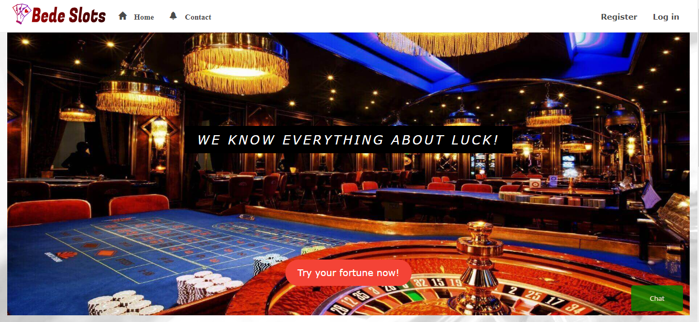
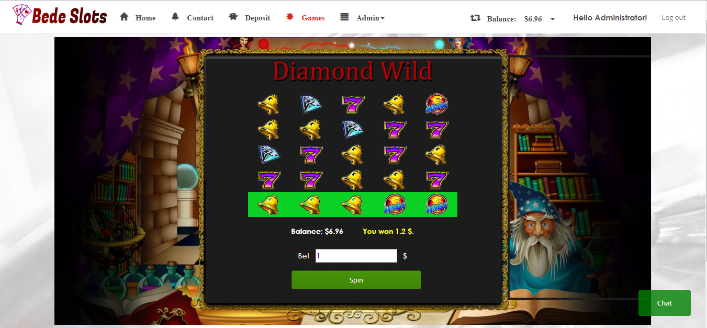
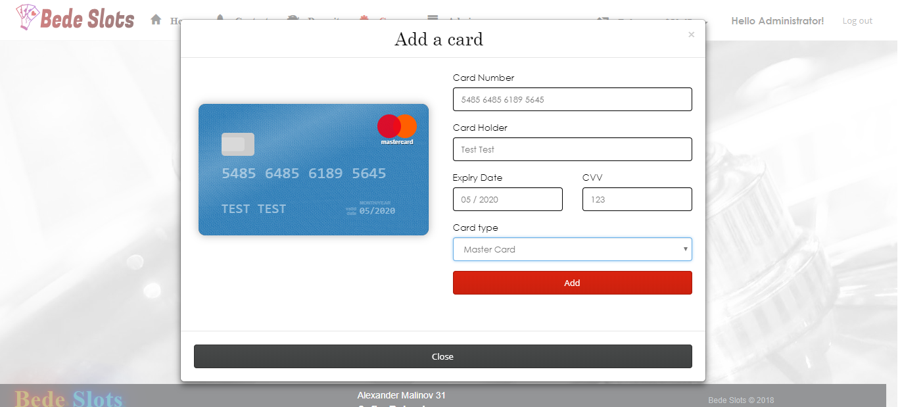
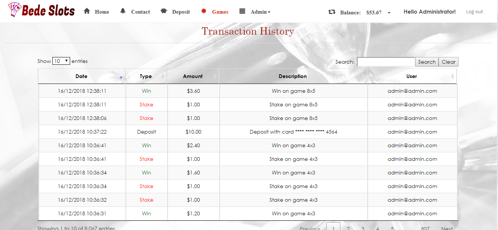

# Bede Slots
* Telerik Academy Final Project

# Main functionality
- Users can ask customer support chatbot for frequently asked questions
- Registered users can manage bank cards, make deposits and withdrawals
- Registered users can play one of the three available slot games
- Registered users can see their transactions history
- Admins can manage users
- Admins can see all transactions of all users

# Technologies
- ASP.NET Core 2.1 MVC 
- MS SQL Server 
- Entity Framework Core 2.1 
- Bootstrap
- jQuery
- JavaScript
- Moq

### Azure: [BedeSlots](https://bedeslots777.azurewebsites.net/)

# Screenshots

|                                         |                                              |
| -----------------------------------     | -------------------------------------------- |   
|          |               |
|          |               |
     
